# Human Intelligence Boost (HIB)

> Веб-сервис коротких когнитивных тренировок на русском языке.
> Финальный MVP проекта курса по вайб-кодингу в **Claude Code**, 2026.

**Human Intelligence Boost (HIB)** — это современный MVP для ежедневных тренировок памяти, внимания, логики, скорости реакции, когнитивного контроля и креативности. Пять научных мини-игр, hi-tech дизайн в тёмной и светлой темах, прогресс в браузере, 9 достижений и 5 уровней.

     

🚀 **Живой деплой:** [https://sk108projects.ru/hib/](https://sk108projects.ru/hib/)

---

## Скриншоты

| Главная (тёмная) | Главная (светлая) |
| :---: | :---: |
| 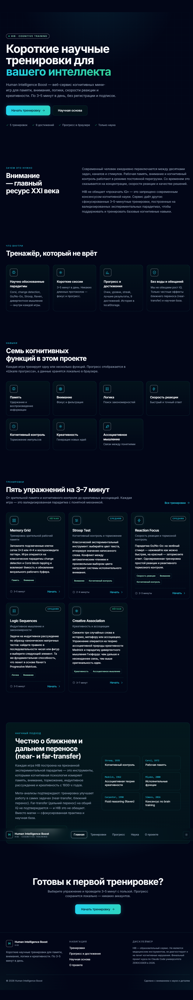 | 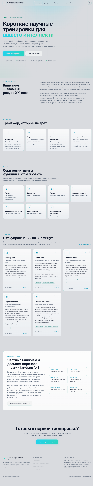 |

| Тренировки | Прогресс |
| :---: | :---: |
| 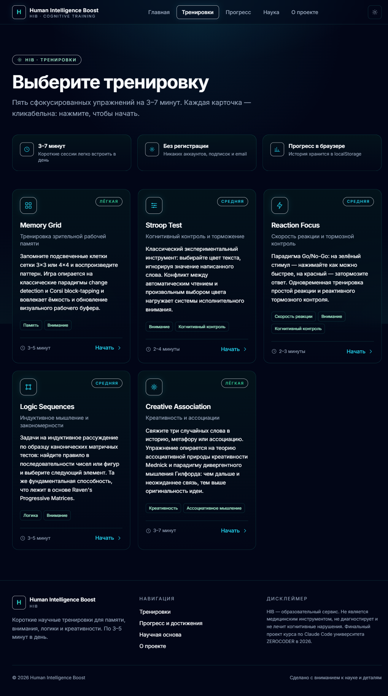 | 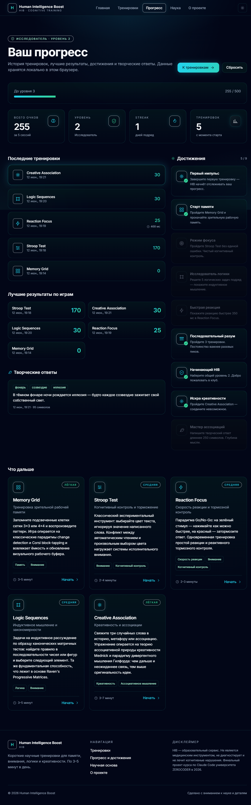 |

| Наука | О проекте |
| :---: | :---: |
| 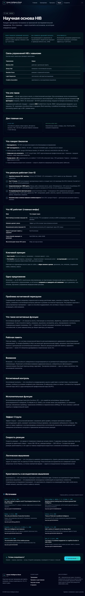 | 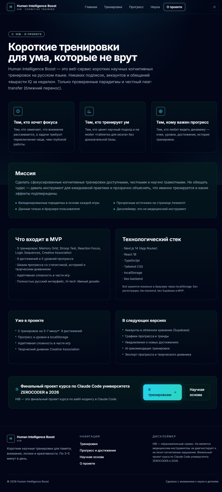 |

| Memory Grid | Stroop Test |
| :---: | :---: |
| 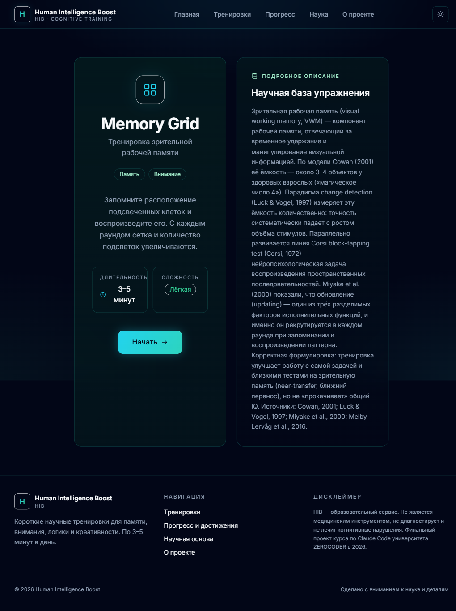 | 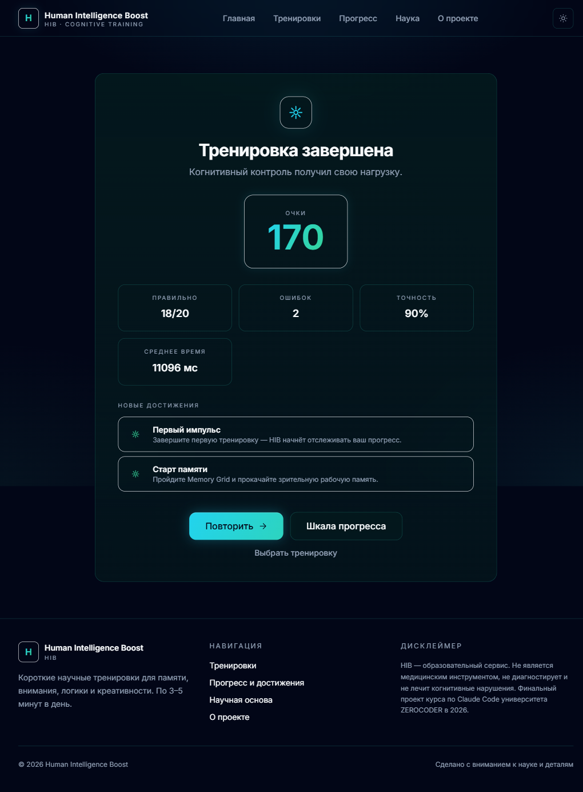 |

| Reaction Focus | Logic Sequences | Creative Association |
| :---: | :---: | :---: |
| 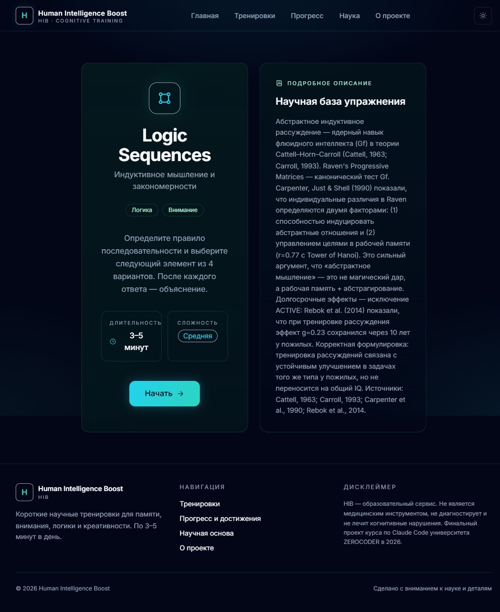 | 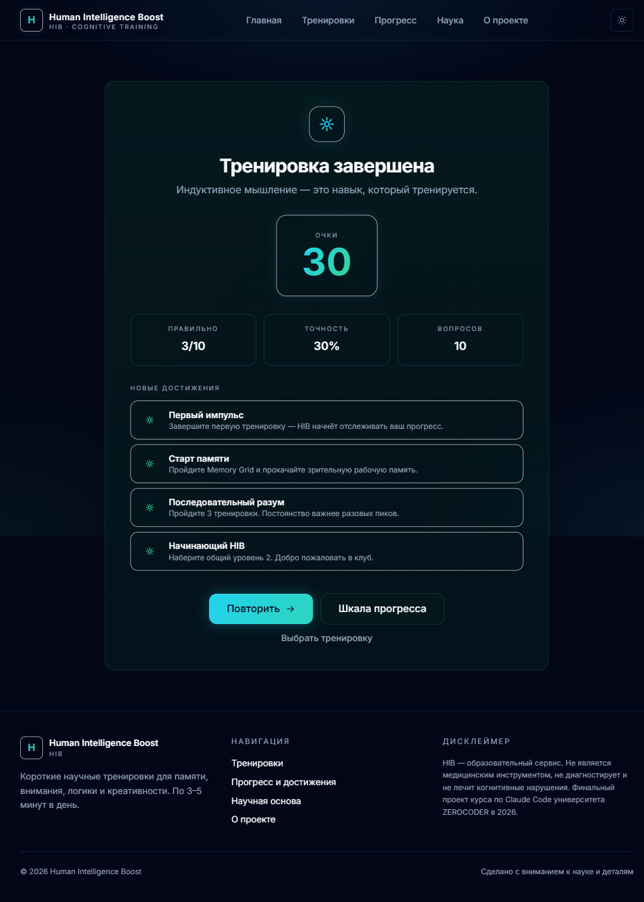 | 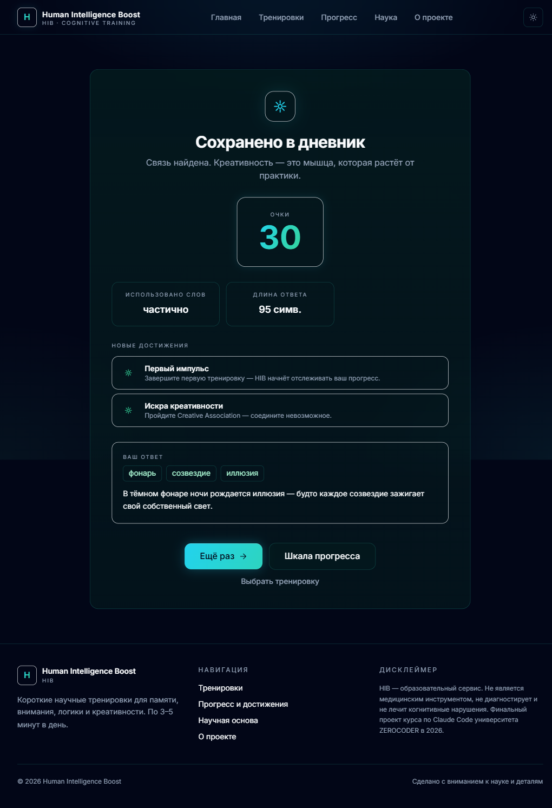 |

---

## Проблема

Рынок когнитивных тренировок полон громких обещаний: «прокачай IQ на 20 пунктов за месяц», «стань гением за 21 день». Мета-анализы показывают, что такие обещания **не соответствуют действительности** ( far-transfer не подтверждается), но **near-transfer** — улучшение именно в тренируемых задачах — подтверждается.

**HIB** честно говорит об этом: мы не обещаем волшебства. Мы даём:

- короткие научные упражнения, по 3–7 минут;
- прозрачную научную базу с 8 источниками;
- честный дисклеймер: «сервис не является медицинским инструментом»;
- визуально приятный, а не «геймифицированный до тошноты» интерфейс.

## Пользователь

- **Кто:** взрослые 25–55 лет, интересующиеся саморазвитием, но не верящие в «нейро-хаки»;
- **Боли:** нет времени на 30-минутные тренажёры; хочется научной честности; хочется видеть прогресс, но без давления;
- **Сценарий:** утром или вечером открыть сайт, пройти 2–3 тренировки за 10 минут, посмотреть dashboard, закрыть вкладку.

## Цели MVP

1. Показать, что когнитивный тренинг может быть коротким и красивым.
2. Дать научную базу в формате «для нормальных людей», а не «для нейроучёных».
3. Подготовить архитектуру, готовую к расширению (Supabase, AI-рекомендации).
4. Продемонстрировать современный стек Next.js 14 + App Router на практике.

---

## ✨ Что внутри

- 🧠 **5 научных тренировок** на 3–7 минут
  - **Memory Grid** — зрительная рабочая память (change detection по мотивам Corsi-block task)
  - **Stroop Test** — когнитивный контроль и интерференция
  - **Reaction Focus** — Go/No-Go, скорость реакции и тормозной контроль
  - **Logic Sequences** — индуктивное мышление (Raven-подобные задачи)
  - **Creative Association** — дивергентное мышление и ассоциации
- 🏆 **9 достижений** и **5 уровней** прогресса
- 📊 **«Шкала прогресса»** с историей, лучшими результатами и творческим дневником
- 🔬 **«Наука»** — 7 разделов, 8 источников с DOI, честный дисклеймер
- 💾 **localStorage** — данные остаются в браузере пользователя
- 🌗 **Тёмная и светлая темы** (default — тёмная, переключатель в шапке)
- 🇷🇺 Полностью русский интерфейс

---

## 🛠 Технологический стек

| Слой | Технология |
|---|---|
| Framework | Next.js 14 (App Router) |
| UI | React 18, TypeScript 5 |
| Стили | Tailwind CSS 3 + кастомные дизайн-токены + CSS-переменные для тем |
| Хранение | localStorage (без backend) |
| Шрифт | Inter (Cyrillic + Latin) |
| Сборка | Static export (`output: "export"`) |
| Аналитика | Нет (в MVP не планируется) |
| Авторизация | Нет (в MVP не планируется) |

Без Supabase, без бэкенда, без регистрации, без платежей.

---

## 🚀 Запуск локально

### Требования
- Node.js 18+ (рекомендую 20+)
- npm 9+

### Команды

```bash
# установка зависимостей
npm install

# dev-сервер с hot-reload
npm run dev
# → http://localhost:3000

# production-сборка (статика в папке out/)
npm run build

# запуск production-сборки через Node
npm run start

# линтер
npm run lint
```

---

## 📦 Готовый билд в репозитории

В этом репозитории в папке `out/` лежит **уже собранный static export** — её можно сразу заливать на любой shared-хостинг (Beget, Timeweb, reg.ru) или отдавать как статику с nginx. Node.js на сервере **не нужен**.

**Важно:** текущий `out/` собран с `basePath: "/hib"` — то есть все ссылки внутри ожидают префикс `/hib`. Это удобно, если заливаете в подпапку домена. Если хотите задеплоить в корень своего домена — пересоберите с пустым `basePath`:

```js
// next.config.mjs
const nextConfig = {
  output: "export",
  images: { unoptimized: true },
  trailingSlash: true,
  // basePath: "/hib",   // ← закомментируйте
};
```

Подробная инструкция по деплою на Beget — в [`DEPLOY.md`](DEPLOY.md).

---

## 🏗 Архитектура

```
hib/
├── app/                              # App Router — 14 маршрутов
│   ├── layout.tsx                    # Root layout: Header + Footer
│   ├── globals.css                   # CSS-переменные тем, glass, gradient
│   ├── page.tsx                      # главная
│   ├── training/                     # выбор тренировок (5 карточек)
│   ├── dashboard/                    # client-component с localStorage
│   ├── research/                     # 7 разделов + 8 источников с DOI
│   ├── about/                        # миссия, стек, roadmap
│   └── games/                        # 5 игр (все client, с localStorage)
│       ├── memory-grid/
│       ├── stroop-test/
│       ├── reaction-focus/
│       ├── logic-sequences/
│       └── creative-association/
├── components/
│   ├── layout/                       # header, footer, nav, mobile-menu
│   ├── cards/                        # game / stat / skill / achievement / last-session
│   ├── games/                        # game-intro, game-result + 5 игр
│   ├── dashboard/                    # dashboard-view с empty state
│   └── ui/                           # icons, glow-card
├── lib/                              # бизнес-логика
│   ├── types.ts                      # GameId, GameResult, CreativeEntry, UserProgress
│   ├── games.ts                      # 5 игр с длинными описаниями
│   ├── levels.ts                     # 5 уровней + STORAGE_KEY
│   ├── scoring.ts                    # 5 формул очков
│   ├── storage.ts                    # безопасный localStorage + streak
│   ├── achievements.ts               # 9 достижений + checkAchievements
│   ├── research.ts                   # 7 разделов + 8 источников
│   ├── logic-questions.ts            # 12 задач
│   ├── creative-words.ts             # 44 русских слова
│   └── utils.ts                      # cn (свой, без clsx), shuffle, formatDate
├── screenshots/                      # PNG-скриншоты для README
├── out/                              # собранный static export (можно заливать на хостинг)
├── public/                           # статические ассеты
├── tailwind.config.ts                # cyan/mint/teal палитра, keyframes
├── next.config.mjs                   # output: "export", basePath: "/hib"
├── tsconfig.json                     # paths: @/* → ./*
├── DEPLOY.md                         # пошаговая инструкция деплоя на Beget
├── package.json
├── LICENSE                           # MIT
└── README.md                         # ← вы здесь
```

---

## 🎮 5 тренировок

| Игра | Навык | Парадигма | Длительность |
|---|---|---|---|
| **Memory Grid** | Память, Внимание | Change detection, Corsi | 3–5 мин |
| **Stroop Test** | Внимание, Когнитивный контроль | Эффект Струпа | 2–4 мин |
| **Reaction Focus** | Скорость реакции, Тормозной контроль | Go/No-Go | 2–3 мин |
| **Logic Sequences** | Логика, Внимание | Fluid reasoning (Gf) | 3–5 мин |
| **Creative Association** | Креативность, Ассоциативное мышление | Divergent thinking, RAT | 3–7 мин |

Подробное описание каждой игры — на странице `/training` внутри приложения.

---

## 🏆 9 достижений

| ID | Название | Условие |
|---|---|---|
| `first-boost` | Первый импульс | Завершить первую тренировку |
| `memory-starter` | Старт памяти | Пройти Memory Grid |
| `focus-mode` | Режим фокуса | Stroop Test без единой ошибки |
| `logic-explorer` | Исследователь логики | 5 правильных ответов в Logic Sequences |
| `fast-reaction` | Быстрая реакция | Среднее RT < 350 мс |
| `consistent-mind` | Последовательный разум | 3 тренировки подряд |
| `hib-beginner` | Начинающий HIB | Достичь уровня 2 |
| `creative-spark` | Искра креативности | Пройти Creative Association |
| `association-builder` | Мастер ассоциаций | Творческий ответ ≥ 250 символов |

---

## 📈 5 уровней

| Уровень | Название | Диапазон очков |
|---|---|---|
| 1 | Новичок | 0–199 |
| 2 | Исследователь | 200–499 |
| 3 | Практик | 500–899 |
| 4 | Мастер | 900–1399 |
| 5 | Архитектор разума | 1400+ |

---

## 🔬 Научная основа

HIB честно говорит: **near-transfer** (улучшение в самих задачах) подтверждается мета-анализами (Au et al., 2015; Melby-Lervåg & Hulme, 2013), **far-transfer** (рост общего IQ) — нет (Melby-Lervåg & Hulme, 2016; Sala & Gobet, 2019).

В приложении на странице «Наука» — **7 разделов**:

1. Что такое когнитивный тренинг и зачем он
2. Near-transfer vs far-transfer
3. Память и рабочая память
4. Внимание и когнитивный контроль
5. Go/No-Go и тормозной контроль
6. Fluid reasoning (Gf) и логика
7. Дивергентное мышление и креативность

Плюс 8 источников с DOI.

Главный дисклеймер:

> HIB не является медицинским инструментом, не диагностирует и не лечит когнитивные нарушения. Сервис предназначен для образовательных и развивающих целей.

---

## 🗺 Roadmap

### ✅ Уже в MVP (v0.1, июнь 2026)
- 5 тренировок, 9 достижений, 5 уровней
- Адаптивная сложность в части игр
- Творческий дневник
- Тёмная и светлая темы
- Адаптивная вёрстка (mobile + desktop)
- Сброс прогресса
- Полностью русский интерфейс
- Static export (без Node.js на сервере)
- Деплой на shared-хостинг (Beget, проверено)

### 🔜 Следующие версии
- Аккаунты и облачное хранение (**Supabase**)
- Графики прогресса и тренды
- Уведомления о новых достижениях
- AI-рекомендации тренировок
- Экспорт прогресса и творческого дневника (JSON/CSV)
- Больше задач в `logic-questions.ts` (сейчас 12)
- Больше слов в `creative-words.ts` (сейчас 44)

### ❌ Что точно не планируется
- Регистрация/авторизация в MVP
- Платежи
- Соц. функции, рейтинги, админка
- Медицинская диагностика

---

## 🌐 Деплой

### Быстрый старт: залить `out/` на shared-хостинг

1. Скачайте или клонируйте репозиторий.
2. Возьмите папку `out/` — это и есть готовый сайт.
3. Залейте её в нужную директорию на хостинге (Beget, reg.ru, Timeweb, и т.п.).
4. Установите права `755` на папки и `644` на файлы.
5. Готово.

Подробная пошаговая инструкция для Beget — в [`DEPLOY.md`](DEPLOY.md). Там же разбор типовых проблем (главная работает, остальные 404 — про права доступа и битый ZIP-архив).

### Vercel / Netlify / Node-хостинг

```bash
npm install
npm run build
npm run start
```

---

## 👤 Автор

**Sergei108** — финальный проект курса по вайб-кодингу в **Claude Code**, 2026.

HIB создан на базе исследования когнитивных тренировок (рабочая память, эффект Струпа, Go/No-Go, fluid reasoning, дивергентное мышление) и принципов научной грамотности: **не обещаем чудес — даём инструмент для ежедневной практики**.

## 📜 Лицензия

[MIT](LICENSE) — используйте, дорабатывайте, переделывайте под себя.
